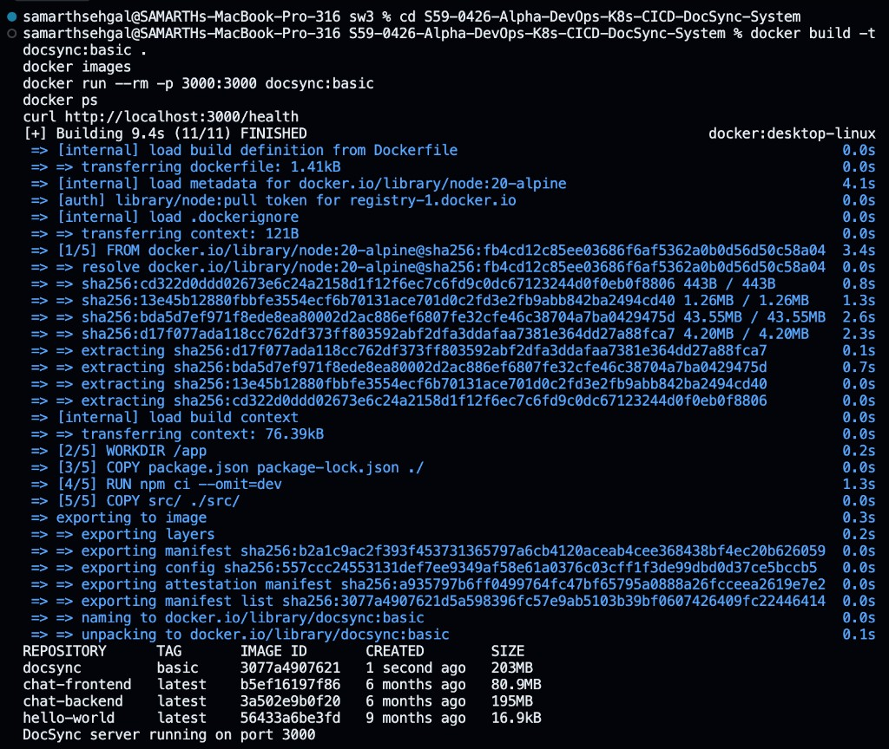

# Proof artifacts (Sprint #3)

This directory holds **screenshots** or **sanitized terminal transcripts** that evidence completed coursework and operational checks. Do **not** commit secrets, kubeconfig contents, or internal credentials.

## Naming convention

Use a predictable prefix so reviewers can map proofs to assignments:

```text
docs/proofs/<assignment-id>-<topic>.png
```

Example: `4.17-kubectl-version.png`, `4.18-get-nodes.png`, `4.18-get-pods-A.png`, `4.19-kind-create.png`, `4.19-script-check.png`, `4.20-get-pods.png`, `4.20-self-heal.png`

---

## Assignment 4.8 / A-01 — DevOps workstation (`spr1-devops-workstation`)

**Related doc:** [`docs/assignments/A-01-devops-workstation.md`](../assignments/A-01-devops-workstation.md)

### Proof checklist

| # | Requirement | Command (or action) | Captured? |
|---|----------------|---------------------|-----------|
| 1 | Git installed | `git --version` | [ ] |
| 2 | Docker CLI / Engine | `docker --version` | [ ] |
| 3 | Docker daemon reachable | `docker ps` | [ ] |
| 4 | kubectl client | `kubectl version --client` | [ ] |
| 5 | Helm client | `helm version` | [ ] |
| 6 | Node.js (target v20 for DocSync) | `node --version` | [ ] |
| 7 | npm | `npm --version` | [ ] |

### Submission notes

- Prefer **PNG** or **PDF** exports; ensure text is readable at 100% zoom.  
- If using **light/dark** themes, maximize contrast for academic submission.  
- Link to this checklist from the PR description when opening **PR1** for review.  

---

## Assignment 4.9 / A-02 — DevOps principles & CI/CD (`spr2-devops-principles`)

**Related doc:** [`docs/assignments/A-02-devops-principles.md`](../assignments/A-02-devops-principles.md)

### Proof checklist

| # | Requirement | Command (or action) | Captured? |
|---|----------------|---------------------|-----------|
| 1 | Current Git branch | `git branch` or IDE branch indicator (screenshot) | [ ] |
| 2 | Commit on branch | `git log -1` or GitHub commit view for this branch | [ ] |
| 3 | GitHub Pull Request | PR page showing title, checks, reviewers (redact if needed) | [ ] |
| 4 | Repository workflow | GitHub **Actions** tab: workflow run for this repo/branch | [ ] |
| 5 | Recent history | `git log --oneline -n 10` (or equivalent graph) | [ ] |

### Submission notes

- For **workflow** proof, include the run **name**, **branch**, and **conclusion** (success/failure) in frame.  
- Link to this checklist from the PR description when opening **PR2** for review.  

---

## Assignment 4.10 / A-03 — Git workflow & conventions (`spr3-git-workflow`)

**Related doc:** [`docs/assignments/A-03-git-workflow.md`](../assignments/A-03-git-workflow.md)

### Proof checklist

| # | Requirement | Command (or action) | Captured? |
|---|----------------|---------------------|-----------|
| 1 | Git branches | `git branch` or GitHub branch dropdown | [ ] |
| 2 | Working tree state | `git status` | [ ] |
| 3 | Recent commits (terminal) | `git log --oneline -n 10` | [ ] |
| 4 | Commit history (GitHub UI) | Repository **Commits** tab for your branch | [ ] |
| 5 | PR creation | “Open pull request” / compare view for this branch | [ ] |

### Submission notes

- For **commit history** vs **git log**, include one terminal capture and one GitHub capture so reviewers can correlate SHAs.  
- Link to this checklist from the PR description when opening **PR3** for review.  

---

## Assignment 4.11 / A-04 — Linux filesystem & permissions (`spr4-linux-permissions`)

**Related doc:** [`docs/assignments/A-04-linux-permissions.md`](../assignments/A-04-linux-permissions.md)

### Proof checklist

| # | Requirement | Command (or action) | Captured? |
|---|----------------|---------------------|-----------|
| 1 | Current directory | `pwd` | [ ] |
| 2 | Detailed listing | `ls -la` (repo root or `scripts/`) | [ ] |
| 3 | Make script executable | `chmod +x <script>` then `ls -l` showing `x` | [ ] |
| 4 | Run script | `./scripts/pre-build-check.sh` or lab copy (terminal output) | [ ] |
| 5 | File permissions | `ls -l` on selected files (modes + owner readable) | [ ] |

### Submission notes

- For **script execution**, include the **command line** and **exit** (or success message) in frame.  
- Link to this checklist from the PR description when opening **PR4** for review.  

---

## Assignment 4.12 / A-05 — Containerization concepts (`spr5-containerization-concepts`)

**Related doc:** [`docs/assignments/A-05-containerization-concepts.md`](../assignments/A-05-containerization-concepts.md)

### Proof checklist

| # | Requirement | Command (or action) | Captured? |
|---|----------------|---------------------|-----------|
| 1 | Docker CLI / Engine version | `docker --version` | [ ] |
| 2 | Local images | `docker images` | [ ] |
| 3 | Running / all containers | `docker ps` and/or `docker ps -a` | [ ] |
| 4 | Lifecycle understanding | Screenshot of diagram or **§ Container lifecycle** in assignment doc / notes | [ ] |
| 5 | Project containerization narrative | `README.md` or related docs in IDE/browser (crop to relevant section) | [ ] |

### Submission notes

- For **lifecycle**, exporting a PDF or PNG from slides is acceptable if terminal-only proof is insufficient.  
- Link to this checklist from the PR description when opening **PR5** for review.  

---

## Assignment 4.13 / A-06 — Docker architecture (`spr6-docker-architecture`)

**Related doc:** [`docs/assignments/A-06-docker-architecture.md`](../assignments/A-06-docker-architecture.md)

### Proof checklist

| # | Requirement | Command (or action) | Captured? |
|---|----------------|---------------------|-----------|
| 1 | Client + Server versions | `docker version` | [ ] |
| 2 | Engine / driver summary | `docker info` (first screenful OK) | [ ] |
| 3 | Local images | `docker images` | [ ] |
| 4 | Containers | `docker ps` and/or `docker ps -a` | [ ] |
| 5 | Image layer history | `docker history <image-name>` | [ ] |
| 6 | Container metadata | `docker inspect <container-id>` | [ ] |

### Submission notes

- For **`docker inspect`**, JSON is long—crop to **State**, **Config**, or use `--format` in the screenshot caption.  
- Link to this checklist from the PR description when opening **PR6** for review.  

---

## Assignment 4.14 / A-07 — Dockerfile basics (`spr7-dockerfile-basics`)

**Related doc:** [`docs/assignments/A-07-dockerfile-basics.md`](../assignments/A-07-dockerfile-basics.md)

### Submitted proof (terminal)

Combined capture: **`docker build -t docsync:basic .`**, **`docker images`** (showing `docsync:basic`), and **`docker run`** with “DocSync server running on port 3000”. The `curl` health check appears in the same session history.



### Proof checklist

| # | Requirement | Command (or action) | Captured? |
|---|----------------|---------------------|-----------|
| 1 | Dockerfile source | IDE / GitHub view of `Dockerfile` | [ ] |
| 2 | Successful image build | `docker build -t docsync:basic .` (tail output) | [ ] |
| 3 | Image present locally | `docker images` (show `docsync:basic`) | [ ] |
| 4 | Running container | `docker run --rm -p 3000:3000 docsync:basic` (logs or second terminal) | [ ] |
| 5 | Health endpoint | `curl http://localhost:3000/health` or browser | [ ] |

### Submission notes

- **Submitted artifact:** [`4.14-docker-lab-terminal.png`](4.14-docker-lab-terminal.png) (build + images + run in one capture).  
- Redact registry credentials or internal hostnames if visible in terminal tabs.  
- Link to this checklist from the PR description when opening **PR7** for review.  

---

## Assignment 4.14 (optimization) / A-08 — Dockerfile optimization (`spr8-dockerfile-optimization`)

**Related doc:** [`docs/assignments/A-08-dockerfile-optimization.md`](../assignments/A-08-dockerfile-optimization.md)

### Proof checklist

| # | Requirement | Command (or action) | Captured? |
|---|----------------|---------------------|-----------|
| 1 | Optimized multi-stage `Dockerfile` | IDE / GitHub view | [ ] |
| 2 | `.dockerignore` | IDE / GitHub view | [ ] |
| 3 | Successful image build | `docker build -t docsync:optimized .` | [ ] |
| 4 | Layer history | `docker history docsync:optimized` | [ ] |
| 5 | Running container | `docker run --rm -p 3000:3000 docsync:optimized` | [ ] |
| 6 | Health endpoint | `curl http://localhost:3000/health` | [ ] |
| 7 | Image config / healthcheck | `docker inspect docsync:optimized` (Healthcheck / User) | [ ] |
| 8 | Non-root user | `docker run --rm docsync:optimized id` or `whoami` | [ ] |

### Submission notes

- Prefer **one PR** attaching all eight proofs or a single consolidated terminal capture where unambiguous.  
- Link to this checklist from the PR description when opening **PR8** for review.  

---

## Assignment 4.15 / A-09 — Build, run, debug locally (`spr9-build-run-containers`)

**Related doc:** [`docs/assignments/A-09-build-run-containers.md`](../assignments/A-09-build-run-containers.md)

### Proof checklist

| # | Requirement | Command (or action) | Captured? |
|---|----------------|---------------------|-----------|
| 1 | Image build | `docker build -t docsync:local .` | [ ] |
| 2 | Local images | `docker images` (show `docsync:local`) | [ ] |
| 3 | Container start | `docker run --name docsync-local -p 3000:3000 docsync:local` (or `-d`) | [ ] |
| 4 | Running processes | `docker ps` | [ ] |
| 5 | Health check | `curl http://localhost:3000/health` | [ ] |
| 6 | Helper script | `./scripts/docker-local-run.sh` (after `chmod +x`) | [ ] |

### Submission notes

- If port **3000** is busy, use **`HOST_PORT=3001 ./scripts/docker-local-run.sh`** and capture `curl` against that port.  
- Link to this checklist from the PR description when opening **PR9** for review.  

---

## Assignment 4.15 (debugging) / A-10 — Container debugging (`spr10-container-debugging`)

**Related doc:** [`docs/assignments/A-10-container-debugging.md`](../assignments/A-10-container-debugging.md)

### Proof checklist

| # | Requirement | Command (or action) | Captured? |
|---|----------------|---------------------|-----------|
| 1 | Running / all containers | `docker ps` / `docker ps -a` | [ ] |
| 2 | Application logs | `docker logs docsync-local` | [ ] |
| 3 | Configuration & state | `docker inspect docsync-local` | [ ] |
| 4 | In-container shell / probe | `docker exec -it docsync-local sh` (or non-interactive `docker exec … id`) | [ ] |
| 5 | Health / connectivity | `curl http://localhost:3000/health` +/or inspect health JSON | [ ] |
| 6 | Read-only debug script | `./scripts/docker-debug-check.sh` | [ ] |

### Submission notes

- The debug script **never** stops or removes containers; capture output after reproducing an issue.  
- If **`docsync-local`** is missing, the script still prints useful **`docker ps`** context — screenshot that path too.  
- Link to this checklist from the PR description when opening **PR10** for review.  

---

## Assignment 4.16 / A-11 — Docker registry & GHCR (`spr11-docker-registry-ghcr`)

**Related doc:** [`docs/assignments/A-11-docker-registry-ghcr.md`](../assignments/A-11-docker-registry-ghcr.md) · **Tagging:** [`docs/registry/IMAGE_TAGGING_STRATEGY.md`](../registry/IMAGE_TAGGING_STRATEGY.md)

### Proof checklist

| # | Requirement | Command (or action) | Captured? |
|---|----------------|---------------------|-----------|
| 1 | Local + remote tags | `docker images` (show `docsync:local` and `ghcr.io/...`) | [ ] |
| 2 | Tag command | `docker tag …` session | [ ] |
| 3 | GHCR login | `docker login ghcr.io` (**token redacted / stdin**) | [ ] |
| 4 | Push | `docker push ghcr.io/...` | [ ] |
| 5 | Package page | GitHub **Packages** screenshot | [ ] |
| 6 | Pull | `docker pull ghcr.io/...` | [ ] |

### Submission notes

- **Never** commit `.env`, PATs, or uncropped tokens — use placeholders in docs and blur screenshots.  
- Link to this checklist from the PR description when opening **PR11** for review.  

---

## Assignment 4.17 / A-12 — Kubernetes intro (`spr12-kubernetes-intro`)

**Related doc:** [`docs/assignments/A-12-kubernetes-intro.md`](../assignments/A-12-kubernetes-intro.md)

### Proof checklist

| # | Requirement | Command (or action) | Captured? |
|---|----------------|---------------------|-----------|
| 1 | kubectl client | `kubectl version --client` | [ ] |
| 2 | Cluster reachability | `kubectl cluster-info` | [ ] |
| 3 | Node inventory | `kubectl get nodes` | [ ] |
| 4 | Architecture / theory | Diagram, slides, or this assignment doc (cropped) | [ ] |

### Submission notes

- If you **lack** a live cluster, screenshot the **error** plus your **kubeconfig context** list (`kubectl config get-contexts`) and note the blocker for the instructor.  
- Link to this checklist from the PR description when opening **PR12** for review.  

---

## Assignment 4.18 / A-13 — Cluster architecture (`spr13-cluster-architecture`)

**Related doc:** [`docs/assignments/A-13-cluster-architecture.md`](../assignments/A-13-cluster-architecture.md) · **Architecture:** [`docs/architecture/K8S_CLUSTER_ARCHITECTURE.md`](../architecture/K8S_CLUSTER_ARCHITECTURE.md)

### Proof checklist

| # | Requirement | Command (or action) | Captured? |
|---|----------------|---------------------|-----------|
| 1 | Nodes | `kubectl get nodes` | [ ] |
| 2 | Node detail | `kubectl describe node <name>` | [ ] |
| 3 | Architecture | Diagram or `K8S_CLUSTER_ARCHITECTURE.md` / assignment excerpt | [ ] |
| 4 | All Pods | `kubectl get pods -A` | [ ] |

### Submission notes

- Redact **internal IPs** or **cloud account IDs** if your institution requires it.  
- Link to this checklist from the PR description when opening **PR13** for review.  

---

## Assignment 4.19 / A-14 — Local Kubernetes cluster (`spr14-local-k8s-cluster`)

**Related doc:** [`docs/assignments/A-14-local-k8s-cluster.md`](../assignments/A-14-local-k8s-cluster.md)

### Proof checklist

| # | Requirement | Command (or action) | Captured? |
|---|----------------|---------------------|-----------|
| 1 | Cluster creation | `kind create cluster --name docsync-cluster` (or equivalent Minikube/k3s) | [ ] |
| 2 | Cluster info | `kubectl cluster-info` | [ ] |
| 3 | Nodes | `kubectl get nodes` | [ ] |
| 4 | All Pods | `kubectl get pods -A` | [ ] |
| 5 | Current context | `kubectl config current-context` (and/or `kubectl config get-contexts`) | [ ] |
| 6 | Read-only check script | `./scripts/k8s-local-cluster-check.sh` | [ ] |

### Submission notes

- If you **cannot** run a local cluster, capture the **blocker** (e.g. Docker not running) plus `kubectl config get-contexts` and note instructor approval for shared cluster access.  
- Link to this checklist from the PR description when opening **PR14** for review.  

---

## Assignment 4.20 / A-15 — Pods and ReplicaSets (`spr15-pods-replicasets`)

**Related doc:** [`docs/assignments/A-15-pods-replicasets.md`](../assignments/A-15-pods-replicasets.md)

### Proof checklist

| # | Requirement | Command (or action) | Captured? |
|---|----------------|---------------------|-----------|
| 1 | Pod manifest | `k8s/pod.yaml` (editor or terminal) | [ ] |
| 2 | ReplicaSet manifest | `k8s/replicaset.yaml` | [ ] |
| 3 | Pods | `kubectl get pods` | [ ] |
| 4 | ReplicaSets | `kubectl get rs` | [ ] |
| 5 | Self-healing | Delete an RS-owned Pod; show replacement (`kubectl get pods -w` or before/after) | [ ] |
| 6 | Read-only check script | `./scripts/k8s-pod-check.sh` | [ ] |

### Submission notes

- Prefer a **dedicated namespace** (e.g. `kubectl create ns docsync-a15`) if you already run the repo **Deployment** in `default`.  
- Link to this checklist from the PR description when opening **PR15** for review.  

---

*Maintained by the DocSync sprint team.*
